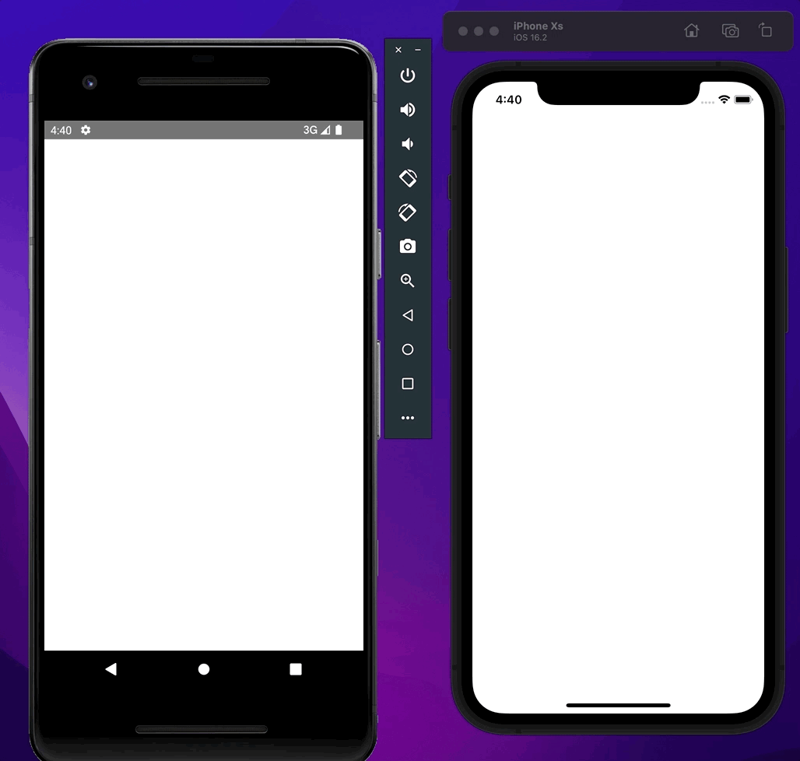
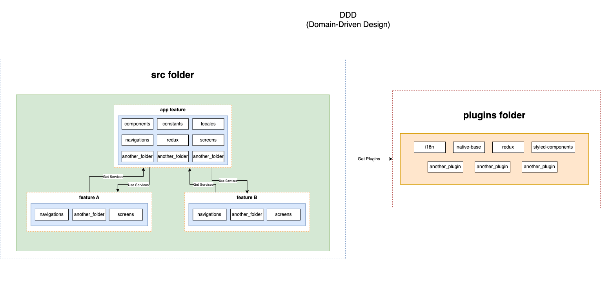

# Standardization

Berikut adalah langkah-langkah untuk mengimplementasikan hal-hal umum terkait standarisasi untuk memulai project pengembangan React Native:

## ⚙️ VSCode Extension

- [Prettier](https://marketplace.visualstudio.com/items?itemName=esbenp.prettier-vscode)

Prettier adalah suatu formatter yang digunakan untuk melakukan formatting ketika melakukan pengembangan menggunakan Tech Stack ini. Extension ini sangat dibutuhkan untuk membuat code yang ditulis memenuhi style yang sudah ditentukan.

- [ESLint](https://marketplace.visualstudio.com/items?itemName=dbaeumer.vscode-eslint)

ESLint adalah suatu extension yang digunakan untuk menganalisis apa yang terjadi di dalam suatu project yang menggunakan Tech Stack ini. ESLint sangat dibutuhkan dalam pengembangan, dikarenakan kita akan mudah untuk melakukan tracing error, fix bug, dan mungkin meningkatkan code quality dalam suatu pengembangan.

- [ES7+ React/Redux/React-Native snippets](https://marketplace.visualstudio.com/items?itemName=dsznajder.es7-react-js-snippets)

Extension ini berguna untuk membantu mempercepat pengembangan React dengan adanya snippet yang sudah disediakan di dalamnya.

### 🛠️ Implementasi

1. Install Dev Dependencies

```shell
yarn add -D prettier @react-native-community/eslint-config@^3.2.0 @typescript-eslint/eslint-plugin@^5.54.1 @typescript-eslint/parser@^5.54.1 eslint@^8.36.0 eslint-config-prettier@^8.7.0 eslint-plugin-prettier@5.0.0 eslint-plugin-react-hooks@^4.6.0
```

2. Update Prettier Config

```json
{
	"semi": false,
	"arrowParens": "avoid",
	"jsxSingleQuote": true,
	"singleQuote": true,
	"trailingComma": "none",
	"tabWidth": 2,
	"useTabs": true,
	"endOfLine": "auto"
}
```

3. Update ESLint Config

```json
// .eslintrc.json
{
	"root": true,
	"env": {
		"node": true,
		"browser": true,
		"es2021": true,
		"jest": true
	},
	"extends": [
		"eslint:recommended",
		"plugin:react/recommended",
		"plugin:prettier/recommended",
		"plugin:@typescript-eslint/recommended",
		"plugin:react-hooks/recommended"
	],
	"parser": "@typescript-eslint/parser",
	"parserOptions": {
		"ecmaFeatures": {
			"jsx": true
		},
		"ecmaVersion": "latest",
		"sourceType": "module"
	},
	"plugins": ["react", "react-native", "@typescript-eslint", "react-hooks"],
	"ignorePatterns": [
		"!.*",
		"dist",
		"node_modules",
		"src/test",
		"__tests__",
		"__mocks__"
	],
	"rules": {
		// JSX
		"react/react-in-jsx-scope": "off",

		// Hook
		"react-hooks/rules-of-hooks": "error",
		"react-hooks/exhaustive-deps": "warn"
	},
	"settings": {
		"react": {
			"version": "detect"
		}
	}
}
```

3. Update VsCode Settings

Tambahkan `.vscode/settings.json` atau update `settings.json` di dalam VSCode untuk menstandarisasi semua user yang memakai VSCode agar config nya dengan standar yang sudah ditentukan.

```json
{
	"typescript.tsdk": "node_modules\\typescript\\lib",
	"typescript.enablePromptUseWorkspaceTsdk": true,
	"editor.defaultFormatter": "rvest.vs-code-prettier-eslint",
	"editor.formatOnPaste": false, // required
	"editor.formatOnType": false, // required
	"editor.formatOnSave": true, // optional
	"editor.formatOnSaveMode": "file", // required to format on save
	"files.autoSave": "off", // optional but recommended
	"vs-code-prettier-eslint.prettierLast": "false", // set as "true" to run 'prettier' last not first
	"[javascript]": {
		"editor.defaultFormatter": "esbenp.prettier-vscode"
	},
	"[typescript]": {
		"editor.defaultFormatter": "esbenp.prettier-vscode"
	},
	"[typescriptreact]": {
		"editor.defaultFormatter": "esbenp.prettier-vscode"
	},
	"[json]": {
		"editor.defaultFormatter": "esbenp.prettier-vscode"
	}
}
```

4. Update `package.json`

Hal terakhir pada implementasi standarisasi dari sisi code adalah penambahan script untuk menjalankan eslint dan prettier secara bersamaan.

```json
// ...package.json
{
	"lint": "eslint \"src/**/*.{js,jsx,ts,tsx,json}\"",
	"lint:fix": "eslint --fix \"src/**/*.{js,jsx,ts,tsx,json}\"",
	"lint:format": "prettier --write \"src/**/*.{js,jsx,ts,tsx,css,md,json}\" --config ./.prettierrc"
}
```

## 📜 Dokumentasi (README)

This is Opinia v1.0.0

### Environment

This application use:

- node : >= 16 (Recommended to use LTS version)
- Visual Studio Code

### Opinia Introduction





If you want have technical understanding not theory, just visit this [Medium Article about DDD structure in React](https://medium.com/@hassan.djirdeh/domain-driven-react-redux-a474ecf7d126)

### Dependencies

These are major dependencies that we used for develop:

- [react-native](https://reactnative.dev/)
- [react](https://reactjs.org/)
- [i18n](https://react.i18next.com/getting-started)
- [react-i18n](https://react.i18next.com/getting-started)
- [react-hook-form](https://react-hook-form.com/)
- [@hookform/resolvers](https://www.npmjs.com/package/@hookform/resolvers)
- [yup](https://github.com/jquense/yup)

### Dev Dependencies

These are additional dependencies that we use for develop:

- [babel-plugin-module-resolver](https://github.com/tleunen/babel-plugin-module-resolver/blob/master/DOCS.md)
- [typescript](https://www.typescriptlang.org/)
- [husky](https://typicode.github.io/husky/#/)
- [prettier](https://prettier.io)

### Installation

1; Install dependencies using yarn

```shell
yarn
```

2; Install dependencies for iOS (for Mac Only)

```shell
pod install
```

---

### Available commands for build

Run metro bundler

```shell
yarn start
```

Build iOS (for Mac Only)

```shell
yarn ios
```

Build Android

```shell
yarn android
```

---

### Available commands for build android

Build android debug

```shell
yarn android:debug
```

File located at `/android/app/build/outputs/apk/debug/app-debug.apk`

---

### Available commands for linting

Run linter and will search for problems, but will not fix

```shell
yarn lint
```

Run linter and will search and try to fix the problems.

```shell
yarn lint:fix
```

Run linter and will call prettier to fix the code style.

```shell
yarn lint:format
```

---

### Available commands for testing

It will go through all the test files and execute them. This command will also be used in pre-hooks and CI checks.

```shell
yarn test
```

This will watch all the test files. It is very useful while writing tests and quickly seeing results.

```shell
yarn test:watch
```

This command will update snapshots for all the presentational components. If the snapshot is not there, it will create it for you. We will discuss snapshots in detail in coming chapters.

```shell
yarn test:update
```

As the name suggests, this command will generate a coverage report.

```shell
yarn test:coverage
```
